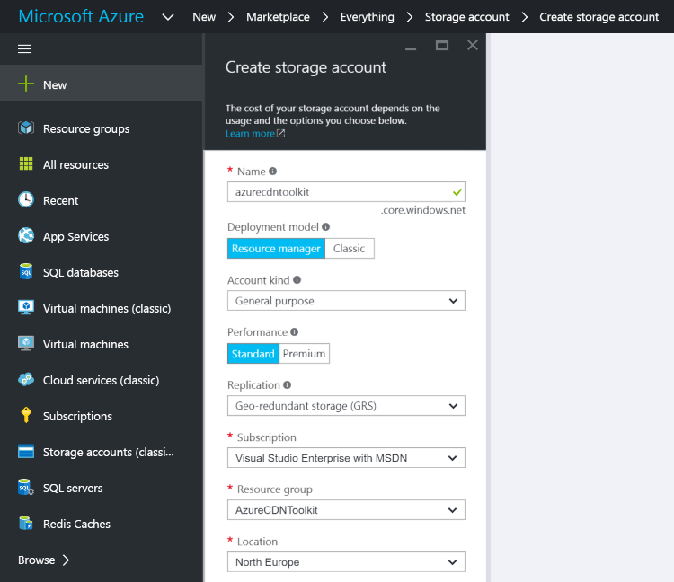
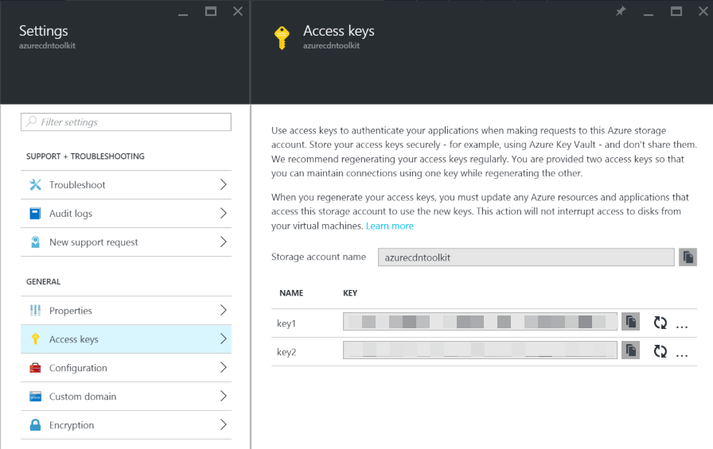
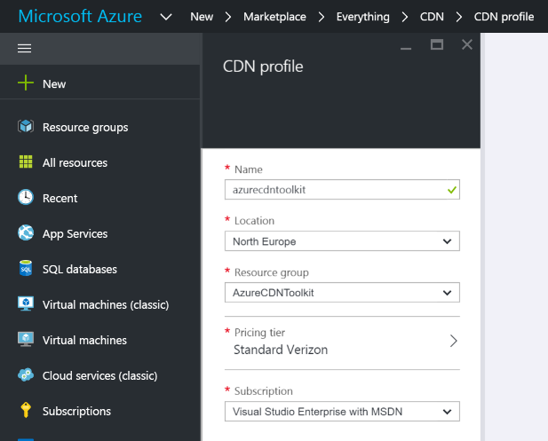
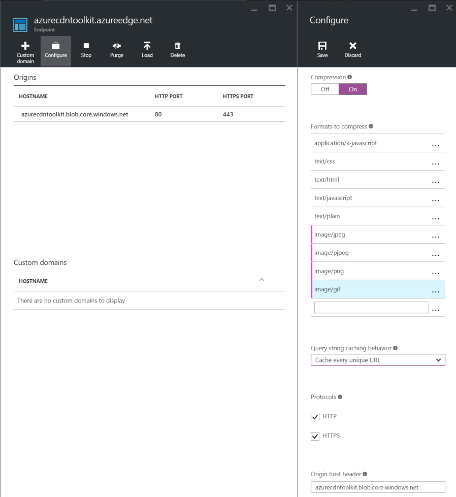
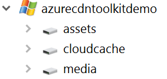
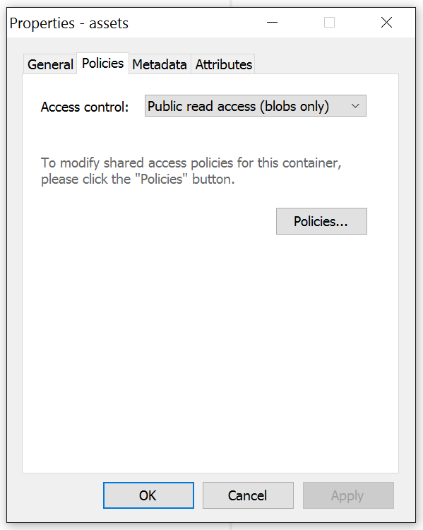

# Azure Setup #

## 1. Storage account ##

To use the Azure CDN Toolkit you will need an Azure Storage account, you create this using the [Azure Portal](https://portal.azure.com/) You will need to create a Resource Group if you don't already have one.

## 2. Get your access keys ##

You will need both the storage account name and a access key for configuration later on.

## 3. Creating a CDN Profile ##

Use the same Resource Group as you created the Storage Account in.

## 4. Creating a CDN Endpoint ##

Once the CDN profile is created you can then create your endpoint which will use the Storage Account created in Step 1.

Select "Storage" as the origin type and select your Storage Account created in Step 1 as the origin hostname.

## 5. Configure the CDN endpoint ##

Once the CDN endpoint is create you can then configure it.

1. Turn compression On
2. Add the following formats to compress
    - image/jpeg
    - image/pjpeg
    - image/png
    - image/gif
3. Select "Cache every unique URL" in the "Query string caching behaviour" drop down 
4. Click save

## 6. Very patient (very) ##

The portal will tell you that your endpoint will be available in 90 minutes, often it takes a lot long than this. If you can set this up 24 hours in advance of needing the CDN to be fully operational.

## 7. Create your storage containers ##

The default setup for the Azure CDN toolkit is to have three containers in your storage account.

- assets
- cloudcache
- media

You only have to create the assets container manually as the others will be create automatically but you may choose to create them manually if you want to.

You will need to use an Azure Storage Explorer to create and manage your blobs, there are various tools for this and they have been compared in detail in this [blog article](https://azure.microsoft.com/en-us/documentation/articles/storage-explorers/).  The screenshots in this documentation are from ClumsyLeaf CloudXplorer.

When creating a container it's **important** to ensure that the container policy is set to "Public read access (blobs only)" otherwise the CDN will not be able to serve content from the container.

