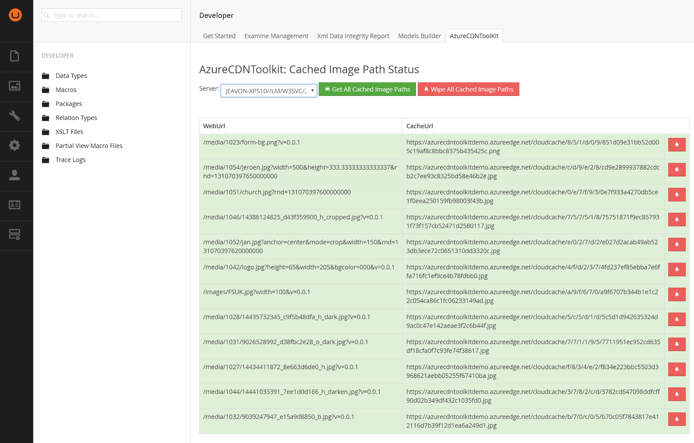

# Umbraco Dashboard #

Included with the AzureCDNToolkit is a dashboard that can be found in the developer section of Umbraco.

This dashboard allows you to view the urls that have been resolved and cached to ImageProcessor.Web.Plugins.AzureBlobCache absolute urls. You can also see here the internal cachebusting going on. The dashboard does **not show asset urls** as they are not cached.

The dashboard is load balancing aware so you can view the cache for any particular one server at a time. You can also wipe an entire cache for a particular server or a single cache item.

